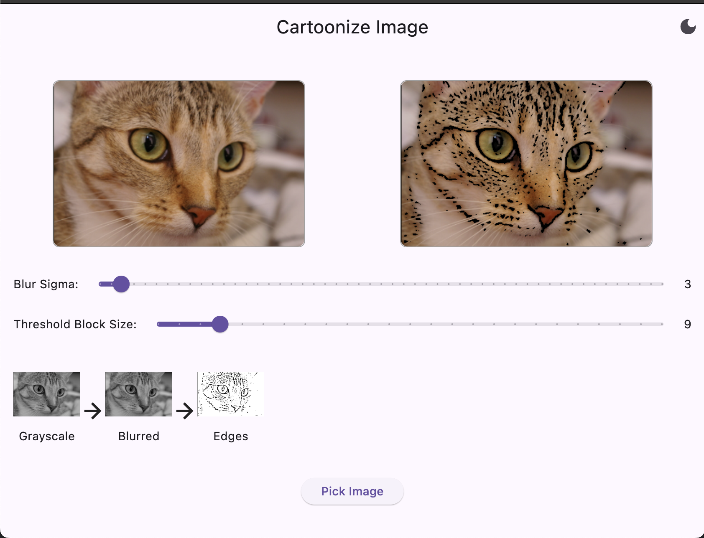

# flutter_toon_it

The **flutter_toon_it** is a Flutter-based image processing application that transforms regular images into cartoonized versions using OpenCV. The app supports both dark and light modes, and users can adjust image processing parameters through interactive sliders.

### Image

### Features:

- Cartoonizes images with grayscale, blurring, and edge detection techniques.
- Sliders to adjust blur intensity and threshold values dynamically.
- Processes image steps left-to-right with arrows indicating progress.
- Dark mode support for a better viewing experience.

### Installation:

1. Clone the repository.
2. Install dependencies by running `flutter pub get`.
3. Ensure OpenCV Dart dependencies are installed.
4. Run the app using `flutter run`.

### Usage:

1. Pick an image from your gallery.
2. Adjust the sliders to customize the cartoonization effect.
3. View processing steps and final cartoonized image.

This app is an example of combining image processing techniques with Flutter for a smooth and interactive UI.
